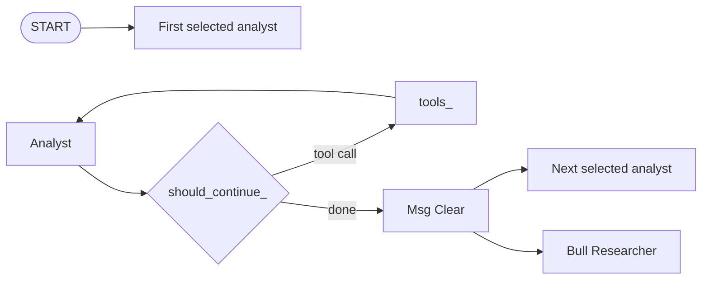

# TradingAgents Agent Graph

This document visualizes the LangGraph workflow assembled in [tradingagents/graph/setup.py](/Users/dmytro_mardus/PycharmProjects/TradingAgents/tradingagents/graph/setup.py).

The analyst stage is dynamic: only the analysts present in `selected_analysts` are added to the graph, and they run in the exact order they are listed. The default order is `market -> social -> news -> fundamentals`.

## Default Graph

```mermaid
flowchart TD
    start([START])

    market["Market Analyst"]
    marketTools["tools_market"]
    marketClear["Msg Clear Market"]

    social["Social Analyst"]
    socialTools["tools_social"]
    socialClear["Msg Clear Social"]

    news["News Analyst"]
    newsTools["tools_news"]
    newsClear["Msg Clear News"]

    fundamentals["Fundamentals Analyst"]
    fundamentalsTools["tools_fundamentals"]
    fundamentalsClear["Msg Clear Fundamentals"]

    bull["Bull Researcher"]
    bear["Bear Researcher"]
    research["Research Manager"]
    trader["Trader"]

    aggressive["Aggressive Analyst"]
    conservative["Conservative Analyst"]
    neutral["Neutral Analyst"]
    portfolio["Portfolio Manager"]
    finish([END])

    start --> market

    market --> marketDecision{"should_continue_market"}
    marketDecision -->|tool call| marketTools
    marketDecision -->|done| marketClear
    marketTools --> market
    marketClear --> social

    social --> socialDecision{"should_continue_social"}
    socialDecision -->|tool call| socialTools
    socialDecision -->|done| socialClear
    socialTools --> social
    socialClear --> news

    news --> newsDecision{"should_continue_news"}
    newsDecision -->|tool call| newsTools
    newsDecision -->|done| newsClear
    newsTools --> news
    newsClear --> fundamentals

    fundamentals --> fundamentalsDecision{"should_continue_fundamentals"}
    fundamentalsDecision -->|tool call| fundamentalsTools
    fundamentalsDecision -->|done| fundamentalsClear
    fundamentalsTools --> fundamentals
    fundamentalsClear --> bull

    bull --> debateBull{"should_continue_debate"}
    debateBull -->|continue| bear
    debateBull -->|stop| research

    bear --> debateBear{"should_continue_debate"}
    debateBear -->|continue| bull
    debateBear -->|stop| research

    research --> trader
    trader --> aggressive

    aggressive --> riskAggressive{"should_continue_risk_analysis"}
    riskAggressive -->|continue| conservative
    riskAggressive -->|stop| portfolio

    conservative --> riskConservative{"should_continue_risk_analysis"}
    riskConservative -->|continue| neutral
    riskConservative -->|stop| portfolio

    neutral --> riskNeutral{"should_continue_risk_analysis"}
    riskNeutral -->|continue| aggressive
    riskNeutral -->|stop| portfolio

    portfolio --> finish
```

## Dynamic Analyst Segment

## Reading Notes

- Each analyst node has a paired `ToolNode` loop and a message-clear node.
- The research phase alternates between bull and bear researchers until the debate condition routes to `Research Manager`.
- The risk phase cycles `Aggressive -> Conservative -> Neutral -> Aggressive` until the condition routes to `Portfolio Manager`.
- `Portfolio Manager` is the only terminal business node and always transitions to `END`.
