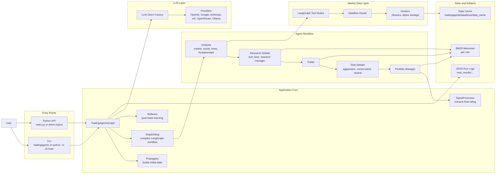
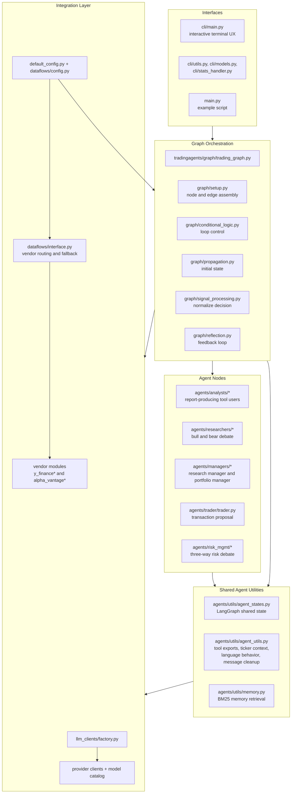
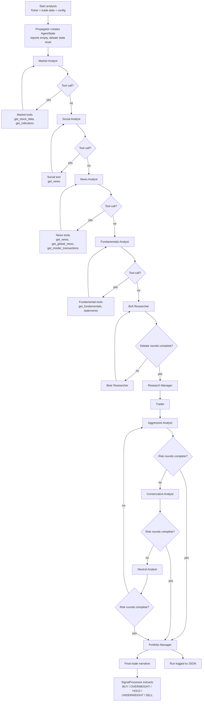
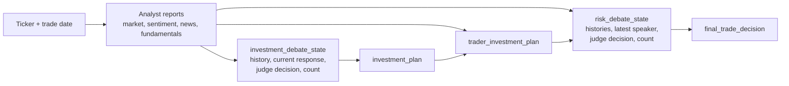

# TradingAgents Architecture

This document maps the current application architecture from the codebase. The diagrams focus on how the CLI and Python entrypoints feed the LangGraph workflow, how agent roles collaborate, and where provider and market-data abstractions sit.

## 1. System Context

## 2. Package Structure and Responsibilities

## 3. Runtime Execution Flow

## 4. State and Information Flow

## 5. Key Architectural Notes

- The application is centered on `TradingAgentsGraph`, which owns configuration, LLM client construction, memory instances, tool-node registration, graph compilation, logging, and optional reflection.
- Analyst nodes are the only role layer that uses LangGraph `ToolNode`s directly. They iterate until the LLM stops issuing tool calls, then write a finalized report back into shared state.
- Debate-driven roles do not call tools directly. They consume analyst reports plus memory retrievals and update nested debate state objects.
- The graph is intentionally sequential in the analyst phase. The selected analyst order determines execution order, and omitted analysts are removed from the runtime graph entirely.
- Market-data access is abstracted through `dataflows/interface.py`, which routes each method to a configured vendor and only falls back automatically when Alpha Vantage rate limits occur.
- LLM access is abstracted through `llm_clients/factory.py`, allowing the same graph to run against multiple providers while preserving provider-specific knobs like OpenAI reasoning effort or Anthropic effort.
- The CLI is a presentation layer over the same graph. It adds questionary-based configuration, Rich live rendering, announcements, and callback-based token/tool statistics, but it does not change the workflow semantics.
